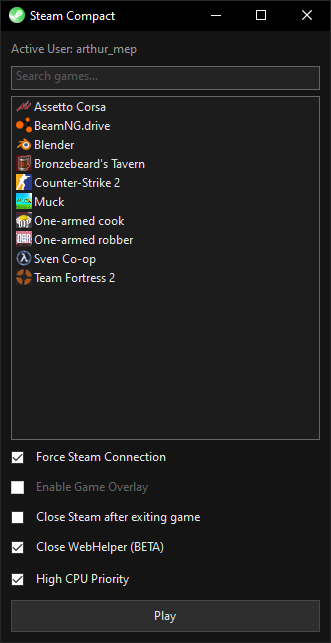
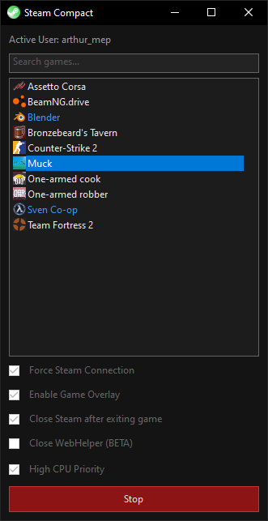

<div align="center">
  

  
# Steam Compact

**Optimized and lightweight Steam launcher for Windows**

</div>

> [!IMPORTANT]
> Before you see this as a **"Virus"** please read:
> - Every line of code is transparent and available for everyone. If you don't trust the .exe, you are encouraged to [compile](#user-content-compile) the program directly from the source code.
> - Please do not download this program from other sources.

## Download
[Download latest release for Windows](https://codeberg.org/uuiz/steamcompact/releases/download/latest/SteamCompact.exe)

## Screenshots

<div align="center">
  
| | |
|:---:|:---:|
|  |  |
| Main screen | Launch multiple games |
  
</div>

## Features

- Game Overlay Toggle
- High CPU priority
- Closing Steam after exiting game
- Killing SteamWebHelper (saves around 600MB of RAM)
- Using less than 3 MB of RAM (excluding Steam services)
- Russian language support

## Compile

You can compile from source using MSVS

```bash
rc.exe resource.rc
cl.exe /utf-8 /EHsc /O2 /std:c++17 main.cpp resource.res /link /SUBSYSTEM:WINDOWS
```
